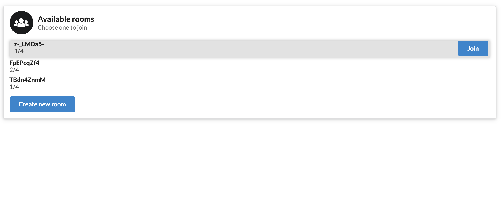
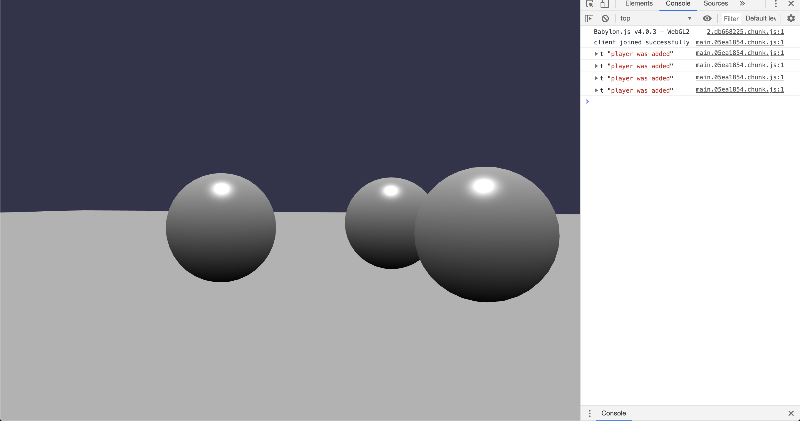

# React + BabylonJS + Colyseus (with BabylonJS NullEngine) starter project

This is a starter project for a realtime 3D multiplayer game with simple rooms lobby.
You can try a live demo [here](https://powerful-shore-32599.herokuapp.com/).




## Main tech stack

- [TypeScript](https://github.com/Microsoft/TypeScript)
- [React](https://reactjs.org)
- [BabylonJS](https://github.com/BabylonJS/Babylon.js)
- [Colyseus](https://github.com/colyseus/colyseus)
- [Node.js](https://nodejs.org/)

### Server
Server uses authoritative arhitecture provided by [Colyseus](https://github.com/colyseus/colyseus).
Game state authority is given by instance of [BabylonJS NullEngine](https://doc.babylonjs.com/features/nullengine) while Colyseus package synchronizes the state to the clients.

NullEngine enables you to run Babylon.js on a node server without having to render anything to the screen. That way you can simulate virtual world on each client but also on the server.

## How to run locally
After cloning the project, position yourself inside root directory, install dependencies and start local server.
```
yarn
yarn watch-debug
```
Your server is now listening on [http://localhost:4000](http://localhost:4000).

To run client code position yourself inside client folder, install dependencies and start react client.
```
cd client
yarn
yarn start
```
